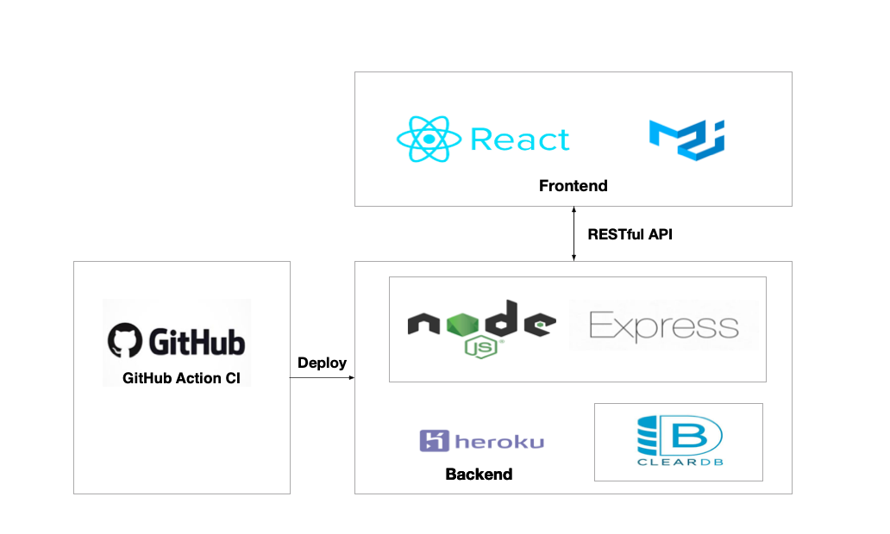

# Contacts-app 
This project is deployed on Heroku [Try the app](https://contacts-app-page.herokuapp.com).

>**Contacts-app** is a full-stack web application to list, sort and search contacts.

---
## Architecture 



---
## Technical choices

* **Frontend**   

  | Tech choices | Reason |
  | --- | --- |
  | create-react-app | to save the work of configuring babel and webpack and focus on the implementation of the feature |
  | material-UI | leverage wealth of customizable components |
  | Pop-up user detail | reduce distraction of jumping between pages |

* **Backend** 

  | Tech choices | 
  | --- |
  | Express |
  | RESTful API      |
  | Heroku ClearDB MySQL add-on |
  | npm mysql |
 
---
## Deployment strategy 

* Deployed on Heroku
* Version Control with GitHub 
* Continue Integration via GitHub actions  
* Dev process 
  ```
  Commit to feature branch -> Merge to master branch -> CI process -> trigger Heroku deployment -> app launches
  ```
---
## Run in local environment

- Create local mysql database and tables by running `mysql.sql`
- Update env, config username and password
  ```
  cp .env.example .env
  ```
- replace mysqlConnectionPool with the defination below in `/backend/database/database.js`
  ```javascript
  const mysqlConnectionPool = mysql.createPool({
    connectionLimit: 10,
    host: process.env.MYSQL_HOST,
    user: process.env.MYSQL_USER,
    password: process.env.MYSQL_PASSWORD,
    database: process.env.MYSQL_DATABASE,
  });
  ```

- Install dependencies
  ```
  yarn install
  ```
- Start the application in two terminals
  ```
  yarn dev-backend
  ```
  ```
  yarn dev-start
  ```

---
## Future Improvement

- investigate more suitable way to store and populate data, possibly noSQL
- better data structure for bulk data pagination
- introduce UT and intergation Test
- use tools like GA or Hotjar to track pageviews and user behaviors

 
